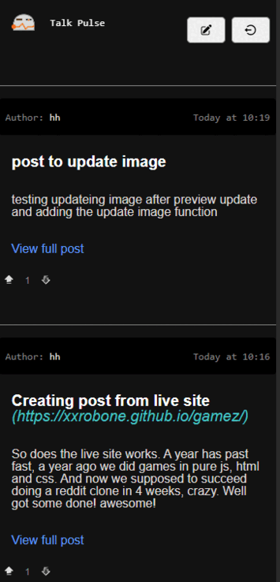

# TALK PULSE - Frontend (reddit clone)

## This is a school project MERN stack assignment

### Backend for this project
Backend part of the project: https://github.com/xxrobone/talkpulse_server-cme

# PREVIEW
### Talk Pulse App 


## Features included

### Reading posts no sign-in needed

### USER
- Sign up
- Sign in
- Auth using JsonWebTokens
- User email verification and reset password

### Posts (User signed in)
- User can create, update and delete own posts 
- "Real time" updates with React Router using loaders (reads) and actions (writes)

### Comment & Votes
- User can add comments and votes if user is signed in

## Features not included
- Additional features
- Libraries for realtime like socket.io, websockets or swr
- Subreddits

### Getting started

Clone the repo: (or fork it)

```sh
git clone https://github.com/xxrobone/talkpulse-cme.git
```
Install dependencies:

```sh
npm i
```
### For this project to work you need the a backend part 
You can find my version of the backend here: https://github.com/xxrobone/talkpulse_server-cme

When connected to a backend or using mockData you can try it out

To Start the project:    
```sh
npm run dev
```


## TECH USED IN THIS PROJECT:
- Vite
- React.js
- React-router-dom
- Sass

<br>
 

 <br>

 ---

 


<p align="left">
<a href="https://www.linkedin.com/in/robert-w%C3%A4gar-1b4661139/" target="blank"></a>
<a href="https://github.com/robonexx" target="blank"></a>
<a href="https://codepen.io/robertwagar" target="blank"></a>

</p>


### Have and Idea you want to bring to life?
- 💬 Reach out and lets have a chat?

#### You can reach me at:

✉️ robertwagar@gmail.com

<br>
<br>

 ---


## Future features

### User

- [ ] User logout after token expires or refresh token activation

### SUBREDDITS

- [ ] ADD model
- [ ] ADD controllers
- [ ] ADD routing

### REPLIES

- [ ] ADD model
- [ ] ADD controllers
- [ ] ADD routing

### USER

- [ ] Profile page / settings page

<br> 
<br>
<br>
<br> 
<br>
<br>


#### Just my notes don't mind these...

## My TODO List

- [x] Verification - working on live site
- [x] Password reset - working on live site
- [x] Votes post & comments - working on live site

### IMAGES

- [x] Add images
- [x] Update images

### Add redirects / close functions to:

- [x] comments
- [x] posts
- [x] delete

### Styling fixes update forms

- [x] Styling fixes update forms
